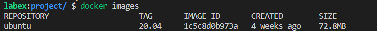

# Challenge pull docker image.

## Introduction

It is used to pull the image in the remote warehouse to the local. It can pull the public image on the Docker Hub or the image in the private warehouse.

## Target

The goal of this challenge is to use docker command to pull the ubuntu:20.04 image from a public Docker repository.

## Result Example

Successfully pulled the ubuntu:20.04 image from a public Docker repository.

## Requirements

- Installed Docker client.
- Logged in to Docker Hub.
- The correct image label or image name.
- Access to Docker Hub container.

