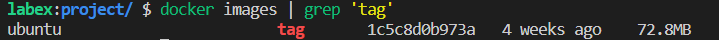

# Label Docker Container

## Introduction

The docker tag command is used to mark the local image and put it into a warehouse. 

## Target

- To tag the image so that it is easier to manage.
- Distinguish the image.

## Result Example

Successfully label ubuntu: 20.04 image as ubuntu:tag.

## Requirements

Need to build an image first.