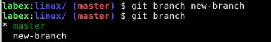

Challenge: Create a new branch using the branch command.

## Introduction

The branch command is used to create a new branch in your Git repository. Branches allow you to work on different features or fixes without interfering with the main codebase.

## Target

Your goal is to create a new branch in the repository using the branch command.

## Result Example

Create a new branch in the repository using the branch command.

## Requirements

A Git repository with at least one commit.
A basic understanding of Git concepts like commits, branches, and the staging area.

