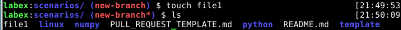

# Make changes to a file in the new branch.

## Introduction

After creating a new branch, you can make changes to files in the branch without affecting the main branch.

## Target

Your goal is to make changes to a file in the new branch.

## Result Example

Here's an example of what you should be able to accomplish by the end of this step:

Note: Switch to the new branch first.

## Requirements

A Git repository with at least one commit.
A new branch created using the branch command.

